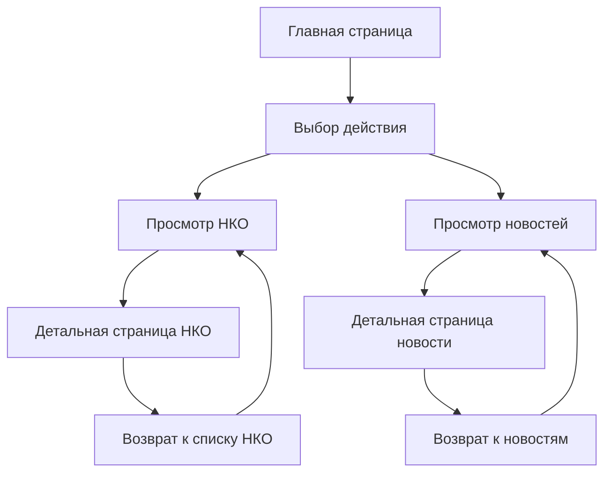

# Архитектура проекта «Добрые дела Росатома»

## Технологический стек
- **Frontend**: Next.js 14 (App Router)
- **Styling**: Tailwind CSS + CSS переменные брендбука
- **UI Components**: shadcn/ui + @21st-dev/magic
- **Typography**: Шрифты Rosatom (Bold, Regular, Light, Italic)
- **Icons**: SVG иконки в стиле брендбука

## Структура проекта

```
/
├── docs/                       # Документация проекта
│   ├── README.md               # Обзор проекта
│   ├── project-architecture.md # Архитектура
│   ├── visual-design-specification.md # Дизайн спецификация
│   └── implementation-guide.md # Руководство по реализации
├── frontend/                   # Фронтенд приложение
│   ├── app/
│   │   ├── globals.css
│   │   ├── layout.tsx
│   │   ├── page.tsx                 # Главная страница
│   │   ├── nko/
│   │   │   ├── page.tsx            # Список НКО
│   │   │   └── [slug]/
│   │   │       └── page.tsx        # Детальная страница НКО
│   │   ├── news/
│   │   │   └── page.tsx            # Новости
│   │   └── components/
│   │       ├── ui/                 # shadcn/ui компоненты
│   │       ├── Header.tsx
│   │       ├── Footer.tsx
│   │       ├── Hero.tsx
│   │       ├── NKOCard.tsx
│   │       ├── NewsCard.tsx
│   │       └── CallToAction.tsx
│   ├── data/
│   │   ├── nko.ts                  # Мокданные НКО
│   │   └── news.ts                 # Мокданные новостей
│   ├── styles/
│   │   └── globals.css             # CSS переменные брендбука
│   └── public/
│       ├── fonts/                  # Шрифты Rosatom
│       └── images/                 # Изображения и логотипы
├── backend/                    # Бэкенд API (планируется)
│   ├── src/
│   │   ├── controllers/
│   │   ├── models/
│   │   ├── routes/
│   │   └── middleware/
│   └── package.json
├── styleguide.md               # Стилевой гайд
├── TZ.txt                      # Техническое задание
├── logos/                      # Логотипы Росатома
└── shrifty/                    # Шрифты Rosatom
```

## Пользовательский поток



## Компонентная архитектура

### Основные компоненты:
1. **Header** - навигация с логотипом Росатома
2. **Hero** - главный баннер с призывом к действию
3. **NKOCard** - карточка организации для списка
4. **NewsCard** - карточка новости для ленты
5. **CallToAction** - блоки с призывами к действию
6. **Footer** - подвал с контактной информацией

### Страницы MVP:
1. **Главная** (/) - hero + 4 блока CTA + превью НКО и новостей
2. **Список НКО** (/nko) - сетка карточек организаций
3. **Детальная НКО** (/nko/[slug]) - полная информация об организации
4. **Новости** (/news) - лента новостей с карточками

## Цветовая схема и типографика

### Основные цвета:
- Primary: #025EA1 (Pantone 660 C)
- Secondary: #6CACE4 (Pantone 284 C)
- Text: #333333 (90 Black)
- Background: #FFFFFF
- Border: #E0E0E0 (Pantone 427 C)

### Типографика:
- H1: Rosatom Bold, 38px
- H2: Rosatom Bold, 28px, #025EA1
- H3: Rosatom Regular, 20px
- Body: Rosatom Regular, 16px, #333333

## Мокданные

### Структура НКО:
```typescript
interface NKO {
  id: string;
  name: string;
  category: string;
  description: string;
  address?: string;
  phone?: string;
  email?: string;
  website?: string;
  social?: {
    vk?: string;
    telegram?: string;
  };
  logo?: string;
  volunteerFunction: string;
}
```

### Структура новости:
```typescript
interface News {
  id: string;
  title: string;
  excerpt: string;
  content: string;
  date: string;
  image?: string;
  category?: string;
}
```

## Адаптивность

### Брейкпоинты:
- Mobile: 320-767px
- Tablet: 768-1023px  
- Desktop: 1024px+

### Сетка:
- Desktop: 3 колонки для НКО
- Tablet: 2 колонки
- Mobile: 1 колонка

## Детализация страниц MVP

### Главная страница:
- Hero секция с градиентом и призывом к действию
- 4 блока Call-to-action (Карта, База знаний, Календарь, Новости)
- Превью популярных НКО (3-4 карточки)
- Превью последних новостей (3-4 карточки)
- Footer с контактной информацией

### Страница списка НКО:
- Заголовок страницы
- Сетка карточек НКО (адаптивная: 3/2/1 колонки)
- Каждая карточка содержит: логотип, название, категорию, краткое описание
- Hover эффекты и анимации

### Детальная страница НКО:
- Hero с логотипом организации
- Полная информация: название, категория, описание, контакты
- Функционал для волонтеров
- Ссылки на сайт и соцсети
- Кнопка "Стать волонтером"

### Страница новостей:
- Заголовок страницы
- Лента новостей с карточками
- Каждая карточка: изображение, заголовок, дата, краткое описание
- Возможность фильтрации по категориям (будущее расширение)

## Технические особенности

### CSS переменные:
```css
:root {
  --color-primary: #025EA1;
  --color-primary-hover: #003274;
  --color-secondary: #6CACE4;
  --color-text-primary: #333333;
  --color-text-secondary: #666666;
  --color-bg-primary: #FFF;
  --color-bg-secondary: #F8F8F8;
  --color-border: #E0E0E0;
  --font-family: 'Rosatom', sans-serif;
  --spacing-xs: 4px;
  --spacing-sm: 8px;
  --spacing-md: 16px;
  --spacing-lg: 24px;
  --spacing-xl: 32px;
  --radius-md: 6px;
  --radius-lg: 8px;
  --shadow-md: 0 4px 16px rgba(0,0,0,0.12);
  --transition-base: 300ms ease-in-out;
}
```

### Анимации и интерактивность:
- Hover эффекты для карточек (подъем и тень)
- Плавные переходы для всех интерактивных элементов
- Анимация появления элементов при скролле
- Ripple эффект для кнопок

### Оптимизация:
- Ленивая загрузка изображений
- Оптимизация шрифтов (subset для кириллицы)
- Минимизация CSS и JS
- Responsive изображения

Этот план обеспечивает создание качественного MVP с фокусом на основные функции сайта, полное соответствие брендбуку Росатома и использование современных технологий и компонентов.